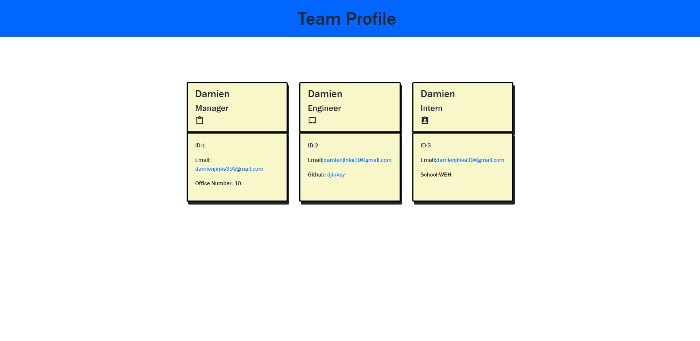

# Team-Profile-Generator


## Description

Team Profile Generator is a backend application to help companies add/update there employees to certain positions in the company. Displaying the employees basic information.

## User Story 

```md
AS A manager
I WANT to generate a webpage that displays my team's basic info
SO THAT I have quick access to their emails and GitHub profiles
```

### Website Screenshots: 



# Table of Contents
    
- [Installation](#installation)
    
- [Usage](#usage)
    
- [License](#license)
    
- [Contributing](#contributing)
    
- [Test](#test)
    
- [Questions](#questions)

# Installation 

To install the repository, please use the following command:

This app requires two packages to be installed:

Inquirer package `npm install --save inquirer`

Jest package `npm i jest`

Run in the command line `npm run test`

Then in the command line of index.js run : `node index.js`

Helpful info that saved me time with inquirer: Inquirer v9 and higher are native esm modules, this mean you cannot use the commonjs syntax require('inquirer') anymore.

# Usage 

Team profile generator allows companies to add and update employee roles, emails, employee ids, office numbers, github and what school there interns attended. 

[A quick demonstration on Team Profile Generator](https://drive.google.com/file/d/1vCfxYnWZ5REInQazN_btnAqmMmNZ_0cX/view?usp=sharing) 

# License

This repository is licensed under MIT

# Test

There are no test for this application

# Questions 
  For any questions and comments please email me at: damienjinks39@gmail.com. To view my other projects visit: Djinksy on Github 